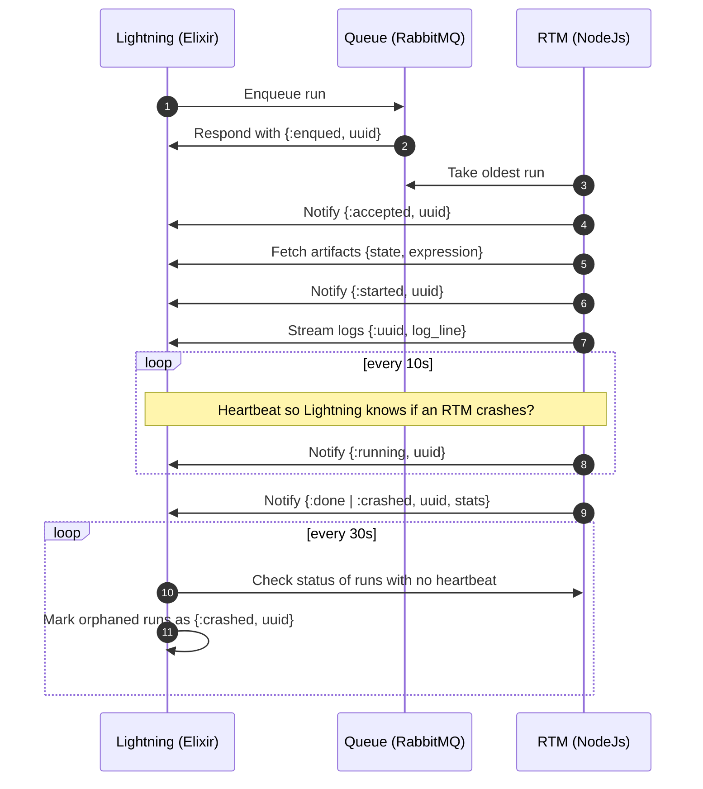

# Sequence Diagram Job Execution via "Web Queue Worker" Architecture.

Draft. Note that this architecture is only for the final `:runs` queue, not for fairness or limiting.

## Lightning

### APIs

1. `GET` for job-run artifacts (state, expression) which can be accessed by the subscriber RTM.
2. `POST` for streaming logs for a given run.
3. `POST` for status update (`{:accepted, :started, :running, :done, :crashed}`) for a given run.

## RTM

1. The RTM should take `N` number of runs at any given time, probably related to how many cores/threads it has access to?
2. The number of RTMs (subscribers) should be scaled up and down based on utilization.

### APIs 
1. Is there an API for RTM application health?
2. And another for the status of a particular run? (Useful to call if the heartbeat fails?)
